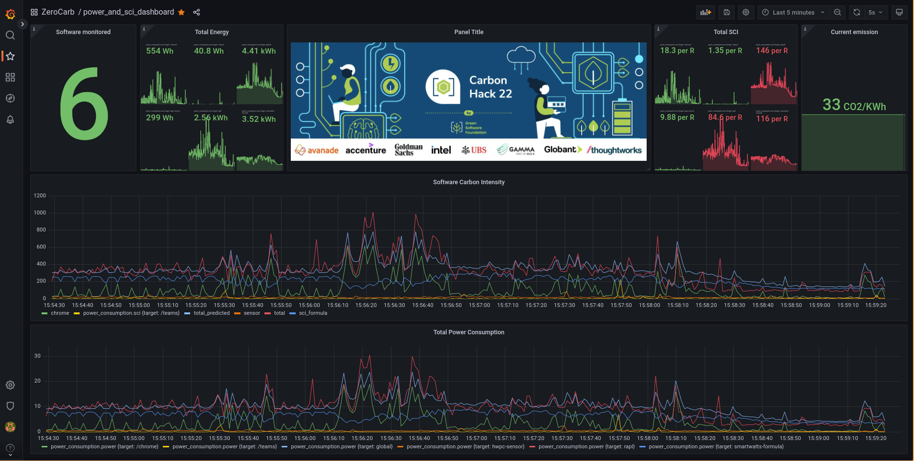

# Zero Carb

This application measures the energy consumption of software running on each computer within a team/organization, making it possible to obtain the [Software Carbon Intensity](https://github.com/Green-Software-Foundation/software_carbon_intensity) (SCI).

It is an entry for the [Green Software Foundation](https://greensoftware.foundation/)'s [CarbonHack22](https://taikai.network/gsf/hackathons/carbonhack22/overview) Hackathon.
## Getting Started

### Pre-requisites

This currently only runs on Linux, so you need a Linux installation.

You need to have [docker](https://docs.docker.com/engine/install/) and [docker compose](https://docs.docker.com/compose/install/) installed.

The solution relies on the Green Software Foundation's Carbon-Aware SDK/API. 
The SDK requires a WattTime user account. 
You need to run the Carbon-Aware web API  to use this solution, [click here]() to learn more on how to get the webapi up and running.

Create `.env` files from these samples, [.env_sample](.env) and [smartwatts-formula](smartwatts-formula/.env), in the same directories. 
Replace the dummy username and password with your watttime username and password in the newly created `.env` files.

Ensure that you have cgroup-tools installed, Run:
```
apt-get update
apt-get -y install cgroup-tools
```

## Run

Clone this repository and its submodules by running:

```
git clone --recurse-submodules git@github.com:yusufraji/zero-carb.git
```

You need to add each software you intend to monitor to a cgroup.
This step is currently done manually, and will be automated later.

### obtain the pid of the application
Run `python ./cgroups/src/process_util.py`
This returns a list of dictionary of all running applications at the moment, like this:
```
[
    {'pid': 103721, 'user': 'chrome', 'username': 'my_username'},
    {'pid': 103721, 'user': 'zoom', 'username': 'my_username'},
    ...
    {'pid': 280263, 'user': 'word', 'username': 'my_username'}    
]
```
Inspect the data to get each the `pid` of each application (`user`) you are interested in.

### Add application pid to cgroups
Repeat below for each application you would like to monitor:
```
cgcreate -g perf_event:<user>;
cgclassify -g perf_event:<user> <pid>
```
if you get:
`cgcreate: can't create cgroup chrome: Operation not permitted`, 
or `Error changing group of pid <pid>: Cgroup, operation not allowed`
run the commands with `sudo`.

### Run the application
Run `docker compose up` to start the services.

### Visualize data

To visualize the results in grafana, visit `localhost:3000` from your browser. 
* Add the influxdb to grafana Data Sources:
```
URL: http://localhost:8086
Database: results
```
leave all other fields as they are.
* import the [dashboard](power_and_sci_dashboard.json)
